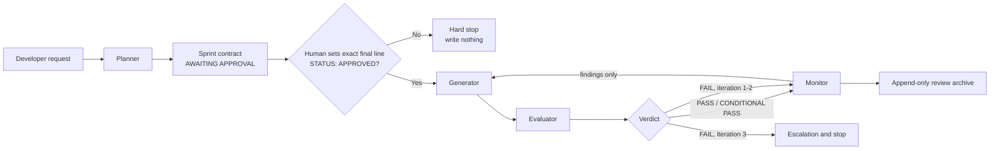
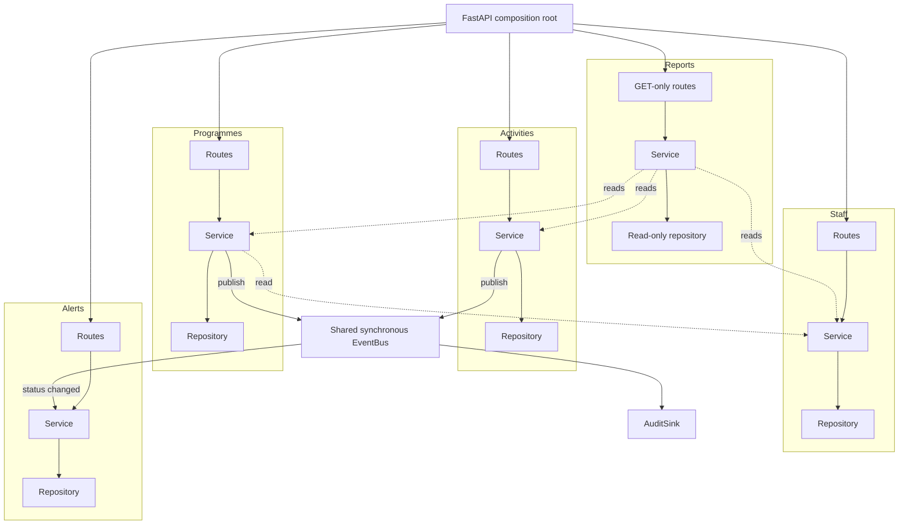
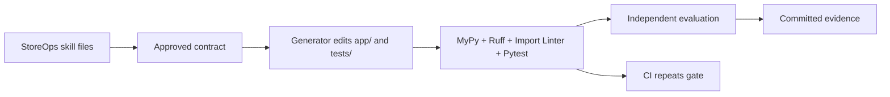
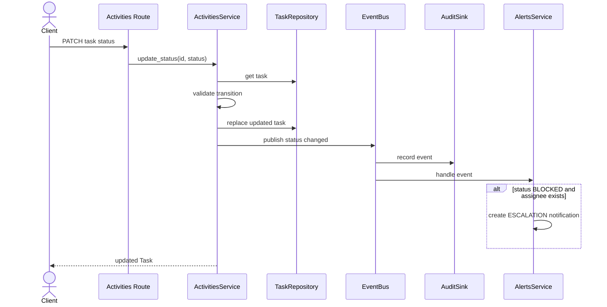
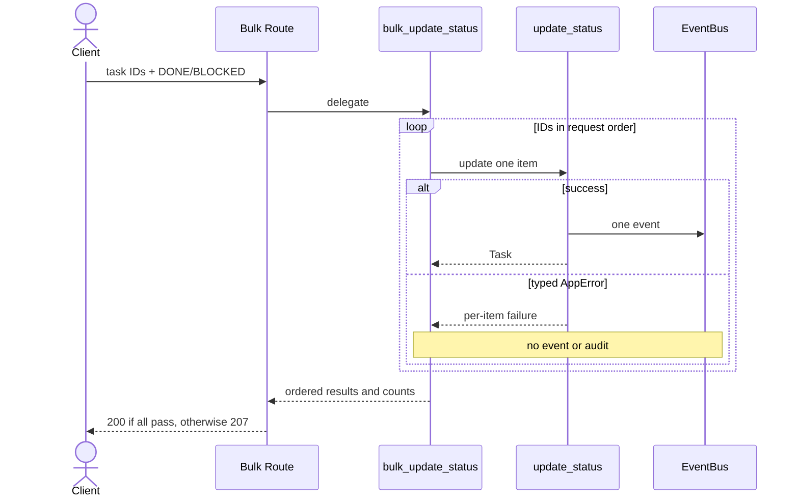
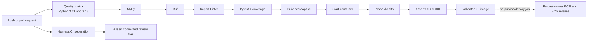
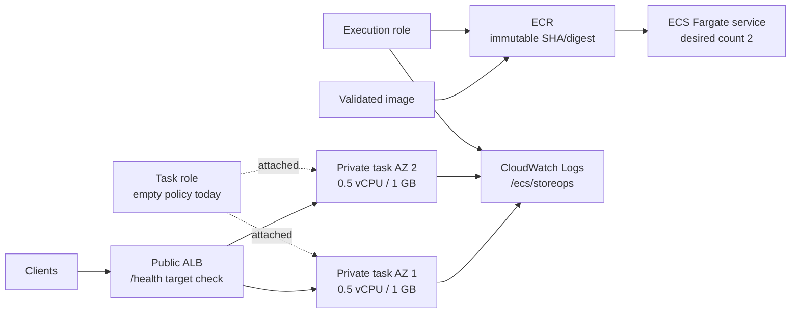

# StoreOps Governance Harness

<p align="center">
  
  
  
  
  
  
  
  
</p>

StoreOps is a retail operations API and an AI-assisted delivery governance harness in one repository. The application demonstrates five bounded business modules, typed failures, event-driven side effects, audit evidence, and strict layer boundaries. The harness governs how an AI planner, generator, evaluator, and monitor may propose, implement, accept, and record a change.

> **Status:** the baseline and Sprint 1 demonstration are complete. The archived run reports `VERDICT: PASS`, 8/8 hard gates, 26/26 scoring checks, 168 passing tests, and 99.66% coverage. Docker and AWS are documented deployment targets; the repository contains no AWS IaC and the archived evidence states that AWS deployment was not executed.

---

# Executive Summary

AI-generated code can appear productive while quietly eroding architecture: routes acquire business rules, modules reach into one another's persistence, raw exceptions escape, and tests assert only HTTP status. StoreOps addresses that problem with a fail-closed governance harness built around explicit contracts, human approval, bounded agent responsibilities, deterministic gates, independent evaluation, and an append-only evidence trail.

The StoreOps application supports store activity management, programme membership, staff discovery, operational alerts, and store-level reporting. It is intentionally small enough to review end to end, but rich enough to exercise real integration risks: activities publish events, alerts consume them, programmes read staff through a service boundary, and reports aggregate three modules without writing.

| Concern | Location | Business Value |
|---|---|---|
| Governance Harness | `.harness/`, `CLAUDE.md`, `PROMPT.md` | Controls AI-assisted planning, generation, evaluation, retry, escalation, and evidence retention |
| StoreOps API | `app/`, `tests/` | Provides the governed FastAPI system and the behavior against which the controls are demonstrated |

The harness catches defects before commit; GitHub Actions repeats the deterministic checks on a clean runner and is authoritative when local and CI results disagree.

---

# Project Overview

This project was built for the **Cognizant AI-Native Architect Build Track** capstone. Its objective is not merely to generate a REST API, but to demonstrate an architecture-governance system that turns a short feature request into traceable, reviewable, testable software while preserving human authority over scope.

It demonstrates a four-agent separation-of-duties workflow, ten StoreOps-specific skill files, a blocking approval checkpoint, eight hard gates, five reproducible scoring dimensions, a maximum three-iteration correction loop, committed Sprint 1 evidence, container validation, and a documented ECS Fargate reference deployment.

## Failure Modes Prevented

| Failure Mode | Description | Prevention Strategy |
|---|---|---|
| FM-1: Boundary bypass | A module imports another module's repository, bypassing ownership and service rules | Import Linter contracts, AST tests, HG-1, HG-5, and HG-6 |
| FM-2: Untyped failures | Raw or framework exceptions escape a service and clients receive unstable errors | `AppError`, Ruff TRY/BLE rules, AST tests, response handlers, and HG-2 |
| FM-3: Hollow tests | Tests assert status without proving state, error codes, events, or audit effects | AC-to-test mappings, four required assertions, coverage, evaluator inspection, HG-3, and HG-8 |
| FM-4: Invisible side effects | A module changes sibling state directly instead of publishing an event | Event-bus rule, audit subscription, boundary checks, publish-path review, HG-4, HG-5, and HG-6 |

## Architecture Goals

- Keep every business module independently understandable and testable.
- Make cross-module reads explicit and cross-module writes event-driven.
- Preserve stable machine-readable errors.
- Convert acceptance criteria into named, verifiable tests.
- Require human approval before generation and independent evidence before acceptance.
- Produce the same verdict for the same gate/checklist results.
- Retain failures and retries instead of recording only final success.

---

# Solution Architecture

## Harness Architecture



## StoreOps Architecture



`app/main.py` is the composition root: it configures logging, installs error handlers, includes all routers, attaches the audit sink, and registers the alerts subscriber. `app/shared/` is technical infrastructure and may not depend on a business module.

## Harness–Application Interaction



The harness governs development artifacts and decisions; it does not run in the StoreOps HTTP request path.

---

# Governance Harness Architecture

| Component | Responsibility | Output |
|---|---|---|
| Planner | Decomposes a request into 4–8 GIVEN/WHEN/THEN criteria, assumptions, risks, exclusions, and named tests | `.harness/output/spec.md`, `.harness/output/sprint-N-contract.md` |
| Generator | Implements only an approved contract, adds named tests, runs gates, and reports evidence without issuing a verdict | `app/**`, `tests/**`, `.harness/output/generator-summary.md` |
| Evaluator | Re-runs tools, evaluates HG-1–HG-8, verifies AC evidence, scores fixed checklists, and emits exactly one verdict | `.harness/output/evaluator-feedback.md` |
| Monitor | Records every verdict/iteration, archives evidence, estimates cost, tracks trends, and signals skill drift | `.harness/reviews/sprint-N-run-log.md` and archived artifacts |

## Approval, Iteration, and Escalation

1. The developer invokes `@planner <feature description>`.
2. The Planner writes a contract ending with `STATUS: AWAITING APPROVAL`.
3. Only a human may change the literal last line to `STATUS: APPROVED`.
4. The Generator checks exact equality before writing anything.
5. The Evaluator emits one literal `VERDICT:` marker.
6. The Monitor archives every verdict, including failed iterations.

The demonstration records real refusals for both `STATUS: AWAITING APPROVAL` and the typo `STATUS: AAPPROVED`; generation began only after exact approval.

| Verdict | Iteration | Action |
|---|---:|---|
| `PASS` | Any | Archive, monitor, advance |
| `CONDITIONAL PASS` | Any | Archive, carry non-blocking conditions, advance |
| `FAIL` | 1 or 2 | Monitor and retry in fresh context with findings only |
| `FAIL` | 3 | Write `escalation.md` and stop |

Escalation records the sprint, feature, blocking `file:line`, failed gate, failure mode, attempts, recipient, and recommended action. This path is specified but was not exercised because Sprint 1 passed on its first evaluated iteration.

## Skill File Strategy

Skills are feedforward context: agents re-read only their declared skills. Rules and implementation mechanics are separated so the Evaluator does not grade code against the same templates used to create it.

| Skill | Reader(s) | Purpose |
|---|---|---|
| `app-context` | All four agents | Modules, endpoints, events, fixtures, orientation |
| `architecture-principles` | Planner, Generator, Evaluator | Five binding rules and rejected patterns |
| `sprint-decomposition` | Planner | Slicing, testable ACs, AC-to-test mapping |
| `component-patterns` | Generator | Routes → Service → Repository mechanics |
| `app-error-contract` | Generator | Typed errors and prohibited exceptions |
| `event-bus-integration` | Generator | Publication, payload, subscription, and audit behavior |
| `how-to-test` | Generator | State, error, event-count, and audit-count assertions |
| `how-to-review` | Evaluator | Evidence-first review and automation blind spots |
| `evaluation-criteria` | Evaluator | Gates, weighted checks, verdict arithmetic |
| `aws-deployment` | Deployment work | ECS/Fargate guidance aligned with `DEPLOYMENT.md` |

The filesystem contains ten skills, although some older narrative text says nine; `aws-deployment` is the tenth.

## Governance Benefits

- Human authority over scope and explicit separation of duties.
- Fail-closed handling of ambiguity.
- A three-iteration cost bound instead of an unbounded generation loop.
- Traceability from prompt through approved contract to archived verdict.
- CI as an independent post-push trust boundary.

---

# StoreOps Architecture

## Architecture Rules

| Rule | Description |
|---|---|
| Module boundary | No module imports another module's repository. Cross-module reads use the owning service. |
| Event bus only | Cross-module side effects use `EventBus.publish`; sibling repository writes and cross-module write calls are forbidden. |
| Error contract | Services and routes raise `AppError` subclasses with stable `code`, `message`, and `statusCode` wire data. |
| Layer separation | Requests flow Routes → Service → Repository. Routes delegate, services own rules, repositories persist. |
| Read-only reports | Reports aggregate through activities, programmes, and staff services without mutating, publishing, or persisting summaries. |

Permitted cross-module dependencies are narrow: programmes validates membership through `StaffService`; reports reads activities, programmes, and staff services; activities publishes status events that alerts consumes independently. `app/shared/` imports no domain module.

## Application Layers

| Layer | Responsibility | Must Not |
|---|---|---|
| Routes | Declare paths, validate HTTP input, select response models/status, delegate | Import repositories, implement domain transitions, catch domain errors |
| Service | Own rules, coordinate its repository, perform permitted service reads, publish events, raise typed errors | Raise raw/framework errors, mutate sibling repositories, embed HTTP concerns |
| Repository | Query and persist the owning module's in-memory entities | Enforce cross-module rules, call services, perform external operations |

```text
HTTP request → routes.py → service.py → repository.py
                              ↓
                         EventBus.publish
```

Repositories are process-local dictionaries seeded with demonstration data. Restarting a process restores seeds; replicas do not share writes.

## Error Handling Contract

`AppError` is the base for module-specific not-found errors, validation/conflict errors, invalid status transitions, duplicate members, and forbidden report writes. Errors serialize consistently:

```json
{
  "error": {
    "code": "TASK_NOT_FOUND",
    "message": "Task 'task-999' does not exist",
    "statusCode": 404,
    "details": { "taskId": "task-999" }
  }
}
```

The last-resort handler returns sanitized `INTERNAL_ERROR` data and logs the escaped exception. Tests verify that the original exception message—including a simulated connection string—is not returned.

## Read-only Reports

Reports are read-only at four levels: a GET-only router, a service with no write operation, a repository with no domain write method, and tests asserting no sibling mutation, event, audit entry, or new report row.

---

# Technology Stack

| Layer | Technology |
|---|---|
| Language | Python 3.11+ |
| Framework | FastAPI 0.115+ |
| Validation | Pydantic 2.9+ |
| ASGI Server | Uvicorn 0.30+ |
| Persistence | In-memory Python repositories |
| Events/Audit | Synchronous in-process `EventBus` and `AuditSink` |
| Testing | Pytest 8.3+, HTTPX 0.27+, pytest-cov 5.0+ |
| Linting | Ruff 0.6+ |
| Type Checking | MyPy 1.11+ in strict mode |
| Dependency Enforcement | Import Linter 2.0+ and AST tests |
| Packaging | `pyproject.toml`, setuptools 68+ |
| Containerization | Multi-stage Docker on `python:3.11-slim` |
| CI/CD | GitHub Actions CI and container validation; no deployment job |
| Cloud | AWS ECS Fargate, ECR, ALB, CloudWatch—documented target only |

There is no `requirements.txt` or `docker-compose.yml`; `pyproject.toml` is the dependency source of truth.

---

# Repository Structure

```text
storeops-harness-python/
├── .github/workflows/ci.yml
├── .harness/
│   ├── agents/                 # Planner, Generator, Evaluator, Monitor
│   ├── skills/                 # ten StoreOps-specific skills
│   ├── output/                 # gitignored active-run state
│   └── reviews/                # committed Sprint 1 evidence
├── app/
│   ├── activities/
│   ├── programmes/
│   ├── staff/
│   ├── alerts/
│   ├── reports/
│   ├── shared/
│   └── main.py
├── tests/                      # mirrors app plus architecture/wiring tests
├── .dockerignore
├── .gitignore
├── .importlinter
├── AI_Native_Architect_Build.pdf
├── capstone_prompt.md
├── CLAUDE.md
├── DEPLOYMENT.md
├── DESIGN_BRIEF.md
├── Dockerfile
├── JOURNAL.md
├── PROMPT.md
├── pyproject.toml
├── REFLECTION.md
└── README.md
```

| Path | Responsibility |
|---|---|
| `.harness/agents/` | Role boundaries, read/write scopes, procedures, and output schemas |
| `.harness/skills/` | Planning, implementation, review, evaluation, and AWS guidance |
| `.harness/output/` | Mutable active-run artifacts; ignored except `.gitkeep` |
| `.harness/reviews/` | Permanent spec, approved contract, summaries, feedback, and run log |
| `.github/workflows/` | CI only; the workflow enforces this separation |
| `app/<module>/` | Models, repository, service, and routes for one capability |
| `app/shared/` | Errors, configuration, logging, events, and audit infrastructure |
| `tests/<module>/` | Unit/integration tests corresponding to application modules |
| `tests/test_architecture.py` | AST enforcement for layers, imports, exceptions, and unique error codes |
| `tests/test_main.py` | Composition, health, tag, and exact OpenAPI inventory tests |
| `CLAUDE.md` | Harness orchestrator contract |
| `DESIGN_BRIEF.md` | Capstone intent, evaluation design, examples, and key decisions |
| `DEPLOYMENT.md` | Executed evidence, AWS design, security guidance, and limitations |
| `PROMPT.md` | Source priority and actual demonstration prompt history |
| `REFLECTION.md` | Run findings, missed issues, cost, and improvement |
| `JOURNAL.md` | Phase-by-phase architecture decisions and assumptions |
| `.importlinter` | Eight dependency contracts backing architecture gates |

Application code uses `app/`, not `src/`, because the capstone's Python command is `uvicorn app.main:app --reload`; the reconciliation is recorded in the Design Brief and Journal.

---

# FastAPI Application

## Modules

| Module | Purpose |
|---|---|
| Activities | List, retrieve, create, and transition tasks; implements bulk shift handover |
| Programmes | List projects and enrol validated staff; publishes membership events |
| Staff | List/resolve users by store and role; read-only to sibling modules |
| Alerts | List notifications and create escalation alerts from blocked-activity events |
| Reports | Compute store summaries from three services without writing |
| Shared | Typed errors, configuration, logging, event bus, and audit sink |

`create_app()` is the application factory and `app.main:app` is the Uvicorn entry point.

---

# API Endpoints

The generated OpenAPI schema exposes 10 business endpoints plus `/health`.

| Method | Endpoint | Description |
|---|---|---|
| `GET` | `/api/tasks` | List tasks; optional `store_id` and `status` filters |
| `POST` | `/api/tasks` | Create a `TODO` task, publish `ACTIVITY_CREATED`; returns 201 |
| `GET` | `/api/tasks/{task_id}` | Get a task or typed `TASK_NOT_FOUND` |
| `PATCH` | `/api/tasks/{task_id}/status` | Apply the transition table and publish one event on success |
| `PATCH` | `/api/activities/bulk-status` | Set tasks to `DONE`/`BLOCKED`; returns 207 when any item fails |
| `GET` | `/api/projects` | List programmes; optional `store_id` filter |
| `POST` | `/api/projects/{project_id}/members` | Validate staff, enrol a member, publish event; returns 201 |
| `GET` | `/api/users` | List users; optional `store_id` and `role` filters |
| `GET` | `/api/notifications` | List notifications; optional recipient/type/store filters |
| `GET` | `/api/reports/store/{store_id}` | Compute a read-only store summary |
| `GET` | `/health` | Return liveness, name, environment, and version |

## Example: Health

```bash
curl http://127.0.0.1:8000/health
```

```json
{"status":"ok","app":"StoreOps API","environment":"local","version":"0.1.0"}
```

## Example: Create a Task

```bash
curl -X POST http://127.0.0.1:8000/api/tasks \
  -H "Content-Type: application/json" \
  -d '{"title":"Verify promotional signage","store_id":"store-101","priority":"HIGH","category":"PLANOGRAM"}'
```

The 201 response assigns the next `task-N` ID, persists it in the process, publishes `ACTIVITY_CREATED`, and produces one audit entry.

## Example: Partial-Failure Handover

```bash
curl -i -X PATCH http://127.0.0.1:8000/api/activities/bulk-status \
  -H "Content-Type: application/json" \
  -d '{"task_ids":["task-1","task-999"],"status":"DONE"}'
```

```json
{
  "updated": 1,
  "failed": 1,
  "results": [
    {"taskId":"task-1","outcome":"UPDATED","status":"DONE","error":null},
    {
      "taskId":"task-999",
      "outcome":"FAILED",
      "status":null,
      "error":{
        "code":"TASK_NOT_FOUND",
        "message":"Task 'task-999' does not exist",
        "statusCode":404,
        "details":{"taskId":"task-999"}
      }
    }
  ]
}
```

This returns 207. One success produces exactly one status-change event and one audit entry.

---

# Event-Driven Architecture

`EventBus` is a synchronous, in-process publish/subscribe implementation with an inspectable publication log. Payloads are plain mappings with camelCase keys, not domain models, so shared infrastructure remains independent of domain schemas.

| Event | Publisher | Consumer(s) | Meaning |
|---|---|---|---|
| `ACTIVITY_CREATED` | `ActivitiesService.create_task` | `AuditSink` | Operational task created |
| `ACTIVITY_STATUS_CHANGED` | `ActivitiesService.update_status` | `AuditSink`, `AlertsService` | Task successfully changed status |
| `PROGRAMME_MEMBER_ADDED` | `ProgrammesService.add_member` | `AuditSink` | User enrolled on programme |

The audit sink subscribes to the complete `EventName` catalogue. Publishing is therefore the audit action; services never call the audit sink directly.





The bus is not a durable broker: events are not replayed or persisted and subscriber execution is synchronous.

---

# Evaluation Framework

## Hard Gates

Hard gates run before scoring. Any failure produces `FAIL` and suppresses the weighted score.

| Gate | Check | Failure Mode | Detection |
|---|---|---|---|
| HG-1 | Zero direct sibling repository imports | FM-1 | Five module-specific Import Linter contracts |
| HG-2 | Every failure uses `AppError`; no raw exception escapes | FM-2 | Ruff TRY/BLE, AST test, review |
| HG-3 | Tests assert state, error code, exact event/audit counts; coverage ≥80% | FM-3 | Pytest/coverage and named-test review |
| HG-4 | Cross-module side effects use `EventBus.publish` | FM-4 | Import Linter and publish-path review |
| HG-5 | Routes import no repository and hold no business rule | FM-1, FM-4 | Layer contracts and AST tests |
| HG-6 | No write originates in reports | FM-1, FM-4 | Import contract and read-only tests |
| HG-7 | Full deterministic suite exits zero | All | MyPy, Ruff, Import Linter, Pytest/Coverage |
| HG-8 | Every approved AC has accurate `file:line` evidence and a named passing test | FM-3 | Summary cross-checked with repository |

## Scoring Dimensions

| Dimension | Weight | Checks | Automated Foundation |
|---|---:|---:|---|
| D1 Architecture Compliance | 35% | 6 | Import Linter |
| D2 Test Quality and Business-Rule Coverage | 25% | 6 | Pytest and coverage |
| D3 Error Contract Integrity | 15% | 5 | Ruff and MyPy |
| D4 Contract Fidelity | 15% | 5 | Named tests and repository verification |
| D5 Toolchain Cleanliness | 10% | 4 | Complete deterministic suite |
| **Total** | **100%** | **26** | Each dimension has automation |

```text
dimension contribution = weight × passed checks / total checks
weighted score = sum of the five contributions
```

## Verdict Logic

| Priority | Condition | Verdict |
|---:|---|---|
| 1 | Any hard gate fails | `FAIL`; do not score |
| 2 | All gates pass and score ≥85 | `PASS` |
| 3 | All gates pass, score 75–84, and all conditions are non-blocking | `CONDITIONAL PASS` |
| 4 | All gates pass and score <75 | `FAIL` |
| 5 | Required AC lacks evidence | `FAIL` through HG-8 |
| 6 | Evaluator evidence is ambiguous | `FAIL`, ambiguity recorded |

A condition is non-blocking only if it breaks no architecture rule, preserves ≥80% coverage, leaves no AC unevidenced, can be fixed later without changing the contract, and is carried into the next contract.

## Archived Demonstration Result

| Measure | Sprint 1 |
|---|---:|
| Verdict | `PASS` |
| Evaluated iterations | 1 |
| Hard gates | 8/8 |
| Binary checks | 26/26 |
| Weighted score | 100.00 |
| Tests | 168 passed |
| Coverage | 99.66% |
| Import contracts | 8 kept, 0 broken |
| Findings | 3 MINOR skill-document drift; 0 MAJOR; 0 BLOCKING |

These are archived results, not an unqualified claim about an arbitrary checkout. Install `.[dev]` and rerun the gate to verify the current workspace.

---

# Demonstration Feature

## Shift Handover Bulk Update

The feature lets a shift lead close or block several activities without discarding valid updates because another item is missing or cannot transition.

| Aspect | Implementation |
|---|---|
| Endpoint | `PATCH /api/activities/bulk-status` |
| Allowed targets | `DONE`, `BLOCKED` |
| All successful | HTTP 200 |
| Any item fails | HTTP 207 with ordered per-item results |
| Request rejection | Empty IDs or invalid handover target returns typed 422 before writes |
| Item errors | Preserves `TASK_NOT_FOUND` and `INVALID_STATUS_TRANSITION` |
| Success effects | One event and one audit entry per updated task |
| Failure effects | Zero events and audit entries for rejected items |

Request flow:

1. Pydantic validates JSON shape and the task-status enum.
2. The service rejects an empty batch or target outside `DONE`/`BLOCKED` before iteration.
3. Each ID delegates to the existing single-item `update_status()` rule.
4. A narrow `except AppError` converts only domain failures to per-item results.
5. Success persists before publication; failure publishes nothing.
6. The response preserves request order and reports `updated`, `failed`, and `results`.
7. The route selects 200 or 207 from the aggregate result.

Reusing the single-item path prevents transition, event, and audit behavior from drifting between single and bulk operations.

---

# Security and Governance

## Implemented Controls

| Control | Evidence |
|---|---|
| Typed client-safe errors | `AppError` hierarchy and global handlers |
| No exception-detail leak | Sanitized 500 response and dedicated test |
| Module access boundaries | Eight Import Linter contracts and AST tests |
| Human authority | Exact final-line approval precondition |
| Agent least privilege | Explicit read/write/protected scopes and separated roles |
| Business-rule testing | Named AC tests, exact side-effect counts, 80% coverage floor |
| Container least privilege | UID/GID 10001, no shell, no source tree or dev tools |
| Secret exclusion | `.gitignore` and `.dockerignore` exclude environment/key files |
| Workflow least privilege | GitHub Actions `contents: read` |
| AWS role model | Separate execution role; empty task-role policy while no AWS API is called |

## Current Boundaries

StoreOps has **no authentication or authorization flow**. `AuthToken` is only a model; issuance and verification are absent. The API must not be exposed to untrusted production traffic as-is.

The application currently has no secrets. `DEPLOYMENT.md` prescribes future AWS Secrets Manager injection, but no such integration or IaC exists today. The documented MVP ALB uses HTTP; HTTPS/ACM is required for real traffic. Data and audit entries are process-local, and the repository implements no WAF, rate limiting, encryption configuration, or security scanning policy.

---

# Local Development Setup

## Prerequisites

- Python 3.11+
- `pip` and Git
- Docker for container workflows
- AWS CLI and scoped credentials only when implementing the documented AWS design

## Clone Repository

```bash
git clone <repository-url>
cd storeops-harness-python
```

## Create Environment

Linux/macOS:

```bash
python3 -m venv .venv
source .venv/bin/activate
```

Windows PowerShell:

```powershell
py -3.11 -m venv .venv
.\.venv\Scripts\Activate.ps1
```

## Install Dependencies

```bash
python -m pip install --upgrade pip
python -m pip install -e ".[dev]"
```

Runtime only:

```bash
python -m pip install .
```

## Configuration

| Variable | Default | Purpose |
|---|---|---|
| `STOREOPS_APP_NAME` | `StoreOps API` | API title and health metadata |
| `STOREOPS_ENV` | `local` | Environment reported by health |
| `STOREOPS_LOG_LEVEL` | `INFO` | Standard-library log level |
| `STOREOPS_SLA_GRACE_MINUTES` | `60` | Configuration value; not consumed by a route today |

An invalid SLA integer silently falls back to 60. No committed environment file is required.

---

# Running Locally

```bash
uvicorn app.main:app --reload --host 127.0.0.1 --port 8000
```

| Resource | URL |
|---|---|
| API | `http://127.0.0.1:8000` |
| Swagger UI | `http://127.0.0.1:8000/docs` |
| ReDoc | `http://127.0.0.1:8000/redoc` |
| OpenAPI JSON | `http://127.0.0.1:8000/openapi.json` |
| Health | `http://127.0.0.1:8000/health` |

`--reload` is development-only. The container starts Uvicorn on `0.0.0.0:8000` without it.

---

# Running Tests

```bash
pytest
pytest --cov
```

Focused examples:

```bash
pytest tests/activities/test_activities_bulk_status.py
pytest tests/test_architecture.py
pytest tests/reports/test_reports_read_only.py
```

The suite contains isolated service tests, FastAPI HTTP integration tests, event-consumer tests, architecture AST tests, exact OpenAPI inventory checks, and read-only report tests. Coverage is branch-aware, targets `app/`, and fails below 80%.

---

# Quality Gates

```bash
mypy .
ruff check .
lint-imports
pytest --cov
```

Combined on shells supporting `&&`:

```bash
mypy . && ruff check . && lint-imports && pytest --cov
```

| Command | Purpose |
|---|---|
| `mypy .` | Strict typing for application and tests |
| `ruff check .` | Style, imports, modernization, and TRY/BLE error rules |
| `lint-imports` | Eight contracts for modules, layers, routes, reports, and shared code |
| `pytest --cov` | Behavior, integration, architecture, and 80% branch coverage |

The Evaluator runs these independently; Generator output is a claim to verify, not inherited evidence.

---

# Docker Deployment

The Dockerfile uses two stages:

1. **Builder:** creates `/opt/venv`, copies `pyproject.toml` and `app/`, and installs runtime dependencies only.
2. **Runtime:** copies only the virtual environment into `python:3.11-slim`, sets production defaults, runs as UID/GID 10001, exposes port 8000, and starts Uvicorn in exec form.

```bash
docker build -t storeops:local .
docker run --rm -p 8000:8000 \
  -e STOREOPS_ENV=local \
  storeops:local
```

```bash
curl http://localhost:8000/health
docker inspect --format='{{json .State.Health}}' <container-id>
```

The health check uses Python standard-library `urllib`; the runtime image does not install `curl`. `.dockerignore` excludes tests, harness artifacts, Git metadata, environments, caches, coverage files, keys, and `.env` files. No Compose file exists because the baseline has no external runtime dependency.

---

# CI/CD Pipeline

The GitHub Actions workflow runs on every branch push and pull request, with stale runs for the same ref cancelled. It is CI plus container validation; it does **not** publish an image or deploy to AWS.



| Stage | Actual Workflow Behavior |
|---|---|
| Validation | MyPy, Ruff, and Import Linter on Python 3.11 and 3.13 |
| Testing | Pytest with coverage on both versions |
| Governance | `.github` must contain workflows only; committed `.harness/reviews/` evidence must exist |
| Build | Buildx builds and loads `storeops:ci` after the gate job |
| Smoke test | Starts the container, polls `/health`, checks `"status":"ok"`, verifies UID 10001 |
| Deployment | Not implemented in `ci.yml` |

---

# AWS Deployment

`DEPLOYMENT.md` recommends **Amazon ECS on Fargate** behind an Application Load Balancer, with the image stored in ECR. This is a reference design, not provisioned infrastructure: no Terraform, CloudFormation, CDK, task-definition JSON, or release workflow is committed.



## Proposed Deployment Model

| Component | Documented Configuration |
|---|---|
| ECR | `storeops`, scan on push, immutable tags, image pinned by digest/SHA |
| ECS/Fargate | `awsvpc`, 0.5 vCPU, 1 GB, port 8000, desired count 2 |
| ALB | Public HTTP listener for the demonstration, target 8000, `/health`, 15s interval, 2 healthy/3 unhealthy |
| Network | Tasks in private subnets; task SG accepts 8000 only from ALB SG |
| Logs | `/ecs/storeops`, `awslogs`, 30-day retention |
| Execution role | ECR pull and CloudWatch logs; future narrow Secrets Manager permission |
| Task role | Empty policy because the application calls no AWS API |
| Rollout | Rolling, minimum healthy 100%, maximum 200% |
| Rollback | Revert the ECS service to the prior immutable task-definition revision |

## Deployment Flow

1. Pass harness and CI gates.
2. Build once and tag with an immutable commit SHA/digest.
3. Push to ECR.
4. Register a task-definition revision referencing that image.
5. Update the ECS service and wait for ALB health convergence.
6. Verify `/health`, `/api/tasks`, bulk partial failure, and a typed transition error through the ALB.
7. Revert to the prior task-definition revision if health or business smoke checks fail.

The largest limitation is in-memory state: each task owns independent data and reseeds on restart. Two replicas demonstrate deployment availability, not a production-consistent data tier. HTTPS/ACM is required before real traffic.

---

# Monitoring and Observability

## Governance Monitoring

The Monitor agent runs after every verdict and never reads `app/`. It transcribes rather than reassesses:

- verdict, eight gate results, and score (or “not computed—gate failed”);
- changed files, commands, and findings without reranking;
- estimated token cost per agent and iteration;
- repeated failure patterns and quality trend;
- skill-file drift candidates; and
- the prompt → spec → contract → summary → feedback → run-log chain.

Sprint 1's run log identified three stale skill examples despite a passing implementation: an old endpoint count/test name, an obsolete bulk response shape, and an incorrect all-fail status example. This is governance-instrument observability, not runtime application monitoring.

## Runtime Observability

| Signal | Current/Designed Mechanism |
|---|---|
| Logs | Python standard logging with timestamp, level, logger, and message |
| Unexpected failures | Exception-level log plus sanitized `INTERNAL_ERROR` response |
| Liveness | `/health` shared by Docker, CI, and proposed ALB checks |
| Domain evidence | In-memory event publication log and audit entries |
| Central logs | CloudWatch Logs is designed but not provisioned |

Metrics, traces, dashboards, alarms, correlation IDs, and durable audit export are not implemented.

---

# Troubleshooting

| Problem | Cause | Resolution |
|---|---|---|
| `ModuleNotFoundError: app` | Wrong directory or project not installed | Run from repository root and install `.[dev]` |
| Quality command not found | Development extra absent from active environment | Activate/recreate the venv and install `python -m pip install -e ".[dev]"` |
| `TestClient` reports HTTPX incompatibility | Stale/inconsistent virtualenv | Recreate it from `pyproject.toml`; do not rely on old site packages |
| Coverage fails | Branch coverage below 80% | Add behavior-focused tests; do not lower `fail_under` |
| Import contract breaks | Layer skip or sibling repository import | Restore Routes → Service → Repository; use services for reads and events for writes |
| `INVALID_STATUS_TRANSITION` | Same-status change or transition from terminal `DONE` | Submit an allowed transition; completed tasks are terminal |
| Bulk request returns 422 | Empty IDs or target outside `DONE`/`BLOCKED` | Provide IDs and a valid handover target |
| Bulk request returns 207 | One or more items failed independently | Inspect each result's typed `error`; successful items are already updated |
| Duplicate alerts in tests | Subscription reset/guard changed | Preserve idempotent `subscribe()` and reset logs/data, not subscriptions |
| `/health` shows `local` in deployment | Wrong/missing variable | Set exact name `STOREOPS_ENV=production` |
| Replica data differs | In-memory per-process repositories | Introduce a durable shared store before multi-replica production use |
| Docker unavailable | Engine missing or stopped | Install/start Docker; CI also builds and probes the image |
| AWS resources missing | Deployment is documented, not provisioned | Implement `DEPLOYMENT.md` with approved access and IaC/release automation |

---

# Key Design Decisions

| Decision | Rationale / Trade-off |
|---|---|
| Use `app/`, not `src/` | Preserves the capstone's Python-specific `uvicorn app.main:app` entry point |
| Commit reviews, ignore output | Active state is mutable; approved verdict history must remain auditable |
| Per-module forbidden contracts | Violations identify the owner while legitimate service reads remain possible |
| Check direct forbidden imports | Avoids rejecting legitimate layered imports; AST/review covers laundering risk |
| Wire events in `main.py` | Keeps producers/consumers ignorant and wiring independent of import order |
| Idempotent subscriptions | Repeated application factories cannot multiply side effects |
| `DONE` is terminal | Completed work remains an audit record; same-status changes are also rejected |
| Inventory through OpenAPI | Verifies the published surface instead of unstable framework internals |
| Separate rules from mechanics | Evaluator does not receive Generator templates |
| Narrow `except AppError` only in bulk | Supports per-item failure without swallowing defects |
| No score after failed gate | A strong average cannot normalize a blocker |
| Score 26 binary checks | Same observations yield the same arithmetic |
| Monitor never reads `app/` | Avoids a second, competing quality assessment |
| Second activities router | Adds `/api/activities/bulk-status` without breaking `/api/tasks` |
| Exact final-line approval | Substrings and malformed approvals cannot authorize generation |
| ECS Fargate over Beanstalk | Matches the tested OCI image and supports role separation/immutable rollback |
| Empty ECS task role | No AWS API call means no application AWS permission |

---

# Future Enhancements

Improvements derived from current repository gaps:

1. Replace in-memory repositories with a durable shared store; define transactions, migrations, backup, and concurrency.
2. Add a durable broker/outbox with retry, idempotency, dead-lettering, and replay.
3. Persist audit evidence with integrity, retention, access control, and query capabilities.
4. Implement authentication/authorization; the current `AuthToken` model is not a security control.
5. Add IaC for ECR, ECS, ALB, VPC, IAM, CloudWatch, HTTPS/ACM, and rollback.
6. Extend Actions with immutable image publication and an approved ECS deployment job.
7. Add structured logs, correlation IDs, metrics, traces, dashboards, and alarms.
8. Fail fast on malformed configuration instead of silently using numeric defaults.
9. Add the proposed D4.6 check for stale skill/contract references and correct the three archived drift findings.
10. Exercise and archive a controlled three-failure escalation; it is specified but not demonstrated.
11. Add HTTPS, rate controls/WAF, image vulnerability policy, and measured autoscaling before production use.

---

# Conclusion

StoreOps Governance Harness demonstrates the difference between using AI to produce code and governing AI-assisted delivery. The FastAPI application provides realistic module boundaries, typed errors, event/audit effects, reporting constraints, and partial-failure behavior. The harness surrounds it with human approval, scoped agents, deterministic gates, independent evaluation, bounded retries, and permanent evidence.

For reviewers, the strongest artifact is not the final `PASS` alone; it is the traceable chain showing what was requested, approved, changed, independently verified, missed by the instrument, and left as deployment design. For developers, the rule is clear: preserve module ownership, publish cross-module side effects, raise typed errors, test business outcomes and exact side-effect counts, and do not treat generated code as accepted until both harness and CI agree.
